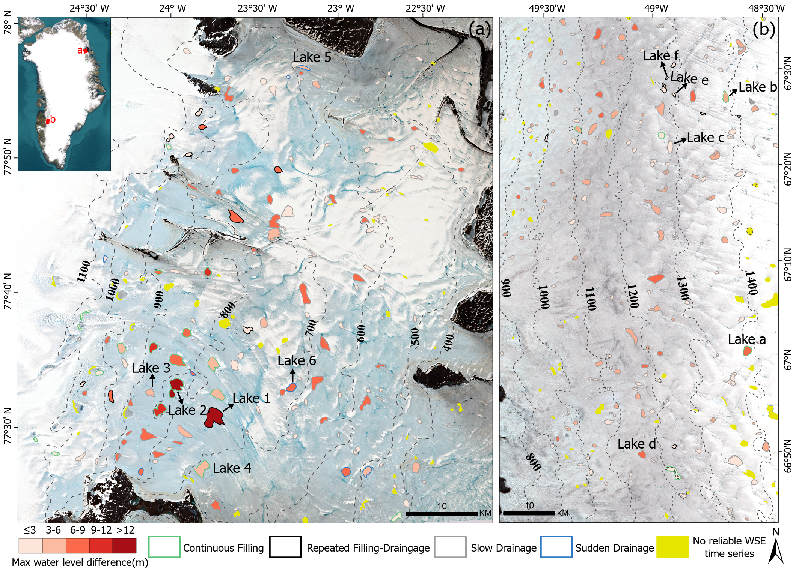
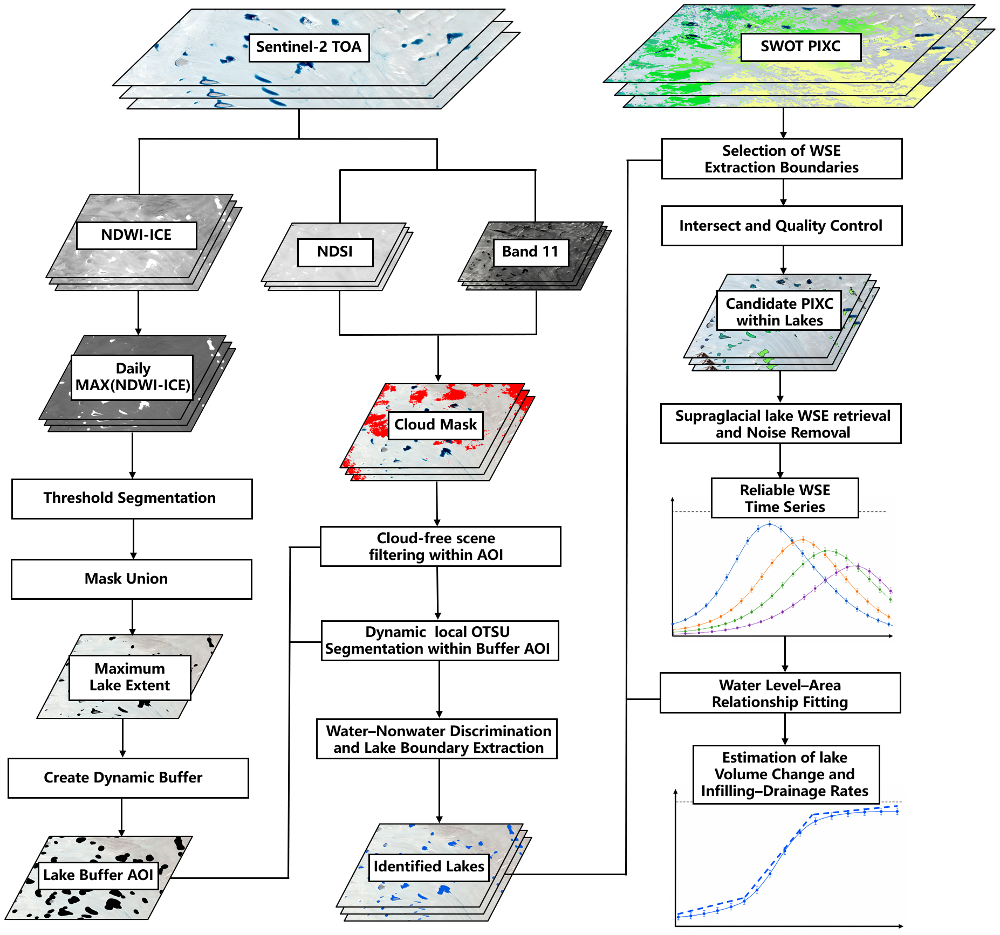
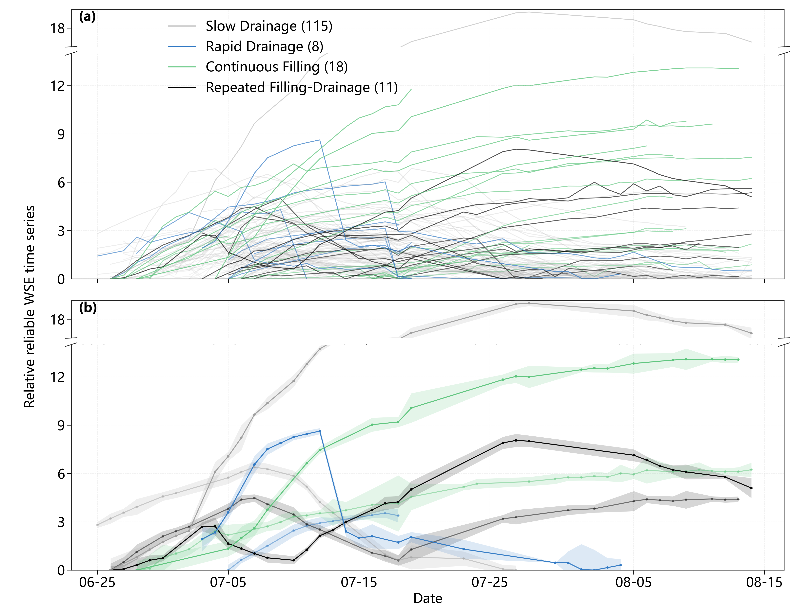
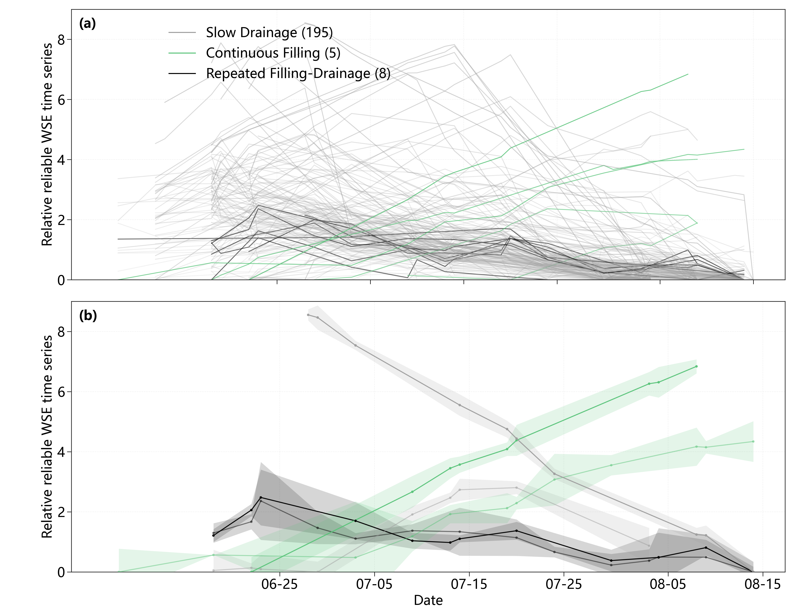
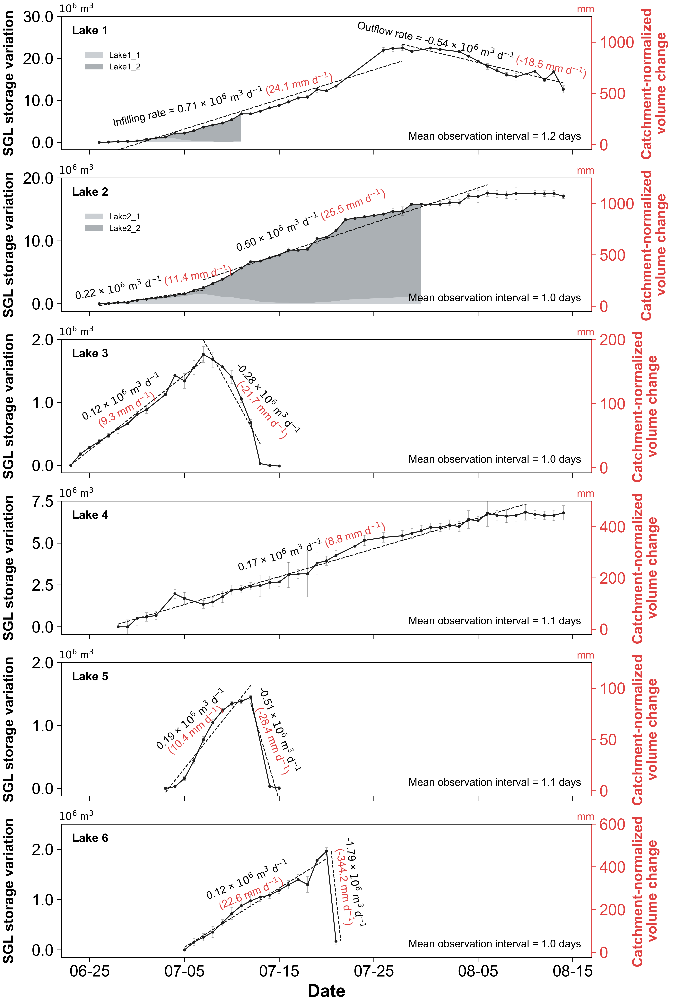
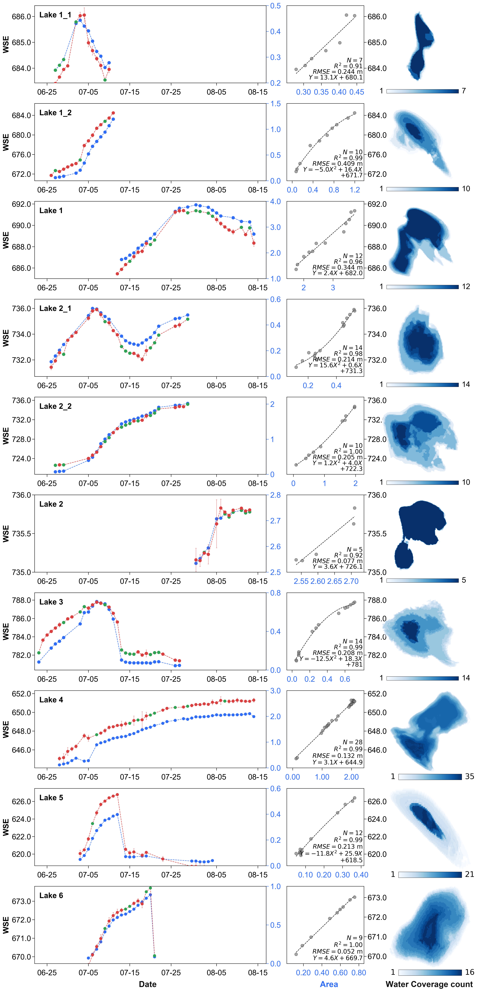

# SWOT PIXC enables robust water-level and volume estimation of supraglacial lakes on the Greenland Ice Sheet


**Companion repository for estimating Greenland supraglacial-lake water levels and volumes from SWOT PIXC observations.**

[Interactive lake atlas](https://greenland-lake-observatory-2026.yqh11055211.chatgpt.site/) · [Code guide](code/README.md) · [Final figures](figures/) · [Canonical results](results/) · [Data sources](DATA_SOURCES.md) · [Citation](CITATION.cff)

This repository contains the reproducible analysis code, manuscript figures, compact result tables, and web-ready data for a multi-sensor investigation of Greenland supraglacial-lake dynamics using **SWOT PIXC**, **Sentinel-2**, **ICESat-2**, and DEM-derived hydrological information.

<p align="center">
  <a href="https://greenland-lake-observatory-2026.yqh11055211.chatgpt.site/">
    
  </a>
  <br><em>Reliable supraglacial-lake WSE variability and seasonal behaviour in northeastern and southwestern Greenland.</em>
</p>

## Why this study matters

Supraglacial lakes temporarily store large volumes of surface meltwater on the Greenland Ice Sheet. Their filling, connection, and drainage influence surface runoff, meltwater transfer to the ice-sheet bed, and potentially short-term ice dynamics. Yet lake evolution can occur faster than conventional satellite-altimetry repeat cycles, while cloud cover interrupts optical observations.

SWOT's Ka-band Radar Interferometer provides two-dimensional, wide-swath elevation measurements. This study develops a temporally constrained quality-control framework that turns SWOT pixel-cloud observations into reliable lake water-surface elevation (WSE) time series, combines those elevations with Sentinel-2 lake areas, and extends lake monitoring from **area change** to **water-level and volume change**.

## Abstract

We developed a robust method for constructing supraglacial-lake WSE time series from SWOT PIXC observations by combining radar-quality screening, iterative pixel-level denoising, and temporal-continuity constraints. Same-day ICESat-2 observations from 72 lakes across Greenland show that PIXC-derived WSE has an RMSE of **0.156 m**, substantially lower than the **0.948 m** obtained from the corresponding Raster product. The method produced reliable WSE time series for **360 lakes** in northeastern and southwestern Greenland, retaining approximately 60% of the screened SWOT observations. Mean valid-observation intervals were 2.7 days in the northeast and 3.8 days in the southwest. SWOT also complemented cloud-limited Sentinel-2 area records, adding observation days equivalent to 21.0% and 99.6% of the optical temporal coverage in the two regions. In northeastern Greenland, accepted area–WSE relationships supported near-daily volume-change records for six representative lakes. These records quantify continuous filling, rapid drainage, repeated filling–drainage, and upstream-to-downstream meltwater transfer.

## Key results

| Result | Value |
|---|---:|
| Lakes used for SWOT–ICESat-2 validation | 72 |
| PIXC WSE RMSE relative to ICESat-2 | **0.156 m** |
| Raster WSE RMSE relative to ICESat-2 | **0.948 m** |
| Reliable regional WSE time series | **360** |
| Northeast / Southwest time series | **152 / 208** |
| SWOT observations retained after screening | ~60% |
| Mean valid-observation interval, Northeast / Southwest | **2.7 / 3.8 days** |
| Additional observation-day coverage relative to S2, Northeast / Southwest | **21.0% / 99.6%** |
| Accepted Northeast area–WSE fit units | **83** |
| Linear / quadratic AICc-selected models | **41 / 42** |
| WSE records after S2-area conversion | **1,773 → 2,163** (+390; 22.0%) |
| Representative volume-series interval | ~1 day |
| Relative volume uncertainty for representative lakes | **2.8%–11.9%** |

### Hydrological interpretation

- Lake 2's infilling rate increased from **0.22 to 0.50 × 10⁶ m³ d⁻¹** after it began receiving upstream water from Lake 3.
- Lake 3 drained at **2.3 times** its preceding infilling rate.
- Lakes 5 and 6 drained at **2.7 and 11.9 times** their respective infilling rates.
- Lake 6 lost **1.79 × 10⁶ m³** between two consecutive daily observations.
- Catchment-normalized infilling rates were approximately twice as high for lakes receiving upstream contributions, demonstrating the importance of inter-lake hydrological connectivity.

> **Counting note.** The manuscript reports 83 accepted area–WSE lake fits. The public `aicc_model_selection.csv` stores 83 fit units associated with 79 unique lake IDs because Lakes 1 and 2 are explicitly separated into pre-merger branch units and post-merger units.

## Study regions and observations

| Region | Approximate latitude | 2024 analysis period | S2 scenes used for regional dynamics | Reliable WSE series | Mean valid interval |
|---|---:|---|---:|---:|---:|
| Northeast, near Kofoed-Hansen Bræ | 77.4–78.0°N | 15 June–15 August | 85 | 152 | 2.7 d |
| Southwest, near Russell Glacier | 66.6–67.6°N | 1 June–15 August | 35 | 208 | 3.8 d |

Across the full validation and regional analyses, the study used:

- **261** SWOT Level-2 High-Rate PIXC granules;
- **18** SWOT Level-2 High-Rate Raster products at 100 m resolution;
- **153** Sentinel-2 Level-2A surface-reflectance scenes;
- **29** ICESat-2 ATL03 granules and **13** ATL06 granules; and
- ArcticDEM-derived elevation, catchment, contour, and drainage-network information.

## Analysis framework

The processing sequence follows the manuscript workflow shown in **Fig. 1** below. No schematic is generated separately for this repository.

### 1. Sentinel-2 lake mapping

Sentinel-2 imagery is used to derive maximum lake extents and time-varying lake areas. Spectral water indices, adaptive lake buffers, cloud screening, and Otsu thresholding are combined to delineate valid water bodies. Lakes smaller than 0.0625 km² are excluded from the inventory used for SWOT analysis, and an extraction boundary larger than 0.04 km² is required to provide a sufficient PIXC sample.

### 2. SWOT PIXC quality control

The workflow retains PIXC water classes 3–6 and screens observations using product quality flags, coherence, sigma0, and cross-track distance. Pixel elevations are iteratively filtered at two standard deviations until the within-lake standard deviation falls below 0.5 m or ten iterations are reached.

### 3. Temporally constrained WSE construction

Adjacent observations are linked when their WSE difference is below 1.5 m, with one anomalous observation allowed to be skipped. Endpoint, local peak, and local trough tests remove implausible jumps, including phase-unwrapping errors of tens of metres. Only time series with at least five valid observations are retained.

### 4. Area–WSE model selection

Same-day S2 area and SWOT WSE observations are matched, with isolated one-day area gaps optionally interpolated. Lakes require at least four matched observations. Linear and quadratic candidates are compared using corrected Akaike information criterion (AICc), and only candidates with R² > 0.8 are eligible.

### 5. Volume and hydrological context

Relative volume change is calculated by integrating the selected area–WSE function from a reference water level. For representative lakes, DEM-derived catchments and flow networks are used to express filling and drainage rates both as water volume and as catchment-normalized runoff depth.

<p align="center">
  
</p>

## Repository contents

```text
.
├── code/
│   ├── northeast/          # complete ordered workflow, including AICc fitting and volume estimation
│   └── southwest/          # ordered workflow through WSE/statistical products
├── figures/                # final manuscript and supplementary PNG figures
├── results/                # canonical compact CSV result tables
├── web_data/               # lightweight data used by the interactive atlas
├── DATA_SOURCES.md         # official source-product and redistribution notes
├── CITATION.cff            # machine-readable citation metadata
├── requirements.txt        # core Python dependencies
├── LICENSE                 # MIT code license
└── LICENSE_DATA.txt        # CC BY 4.0 notice for derived data and figures
```

### Canonical result tables

| File | Content | Typical join keys |
|---|---|---|
| `results/final_wse_branch_timeseries.csv` | Date, WSE, WSE uncertainty, branch, point color, noise status, and noise reason | `region`, `lake_id`, `branch_index`, `date` |
| `results/lake_attributes_all_regions.csv` | Unified lake inventory, behaviour, WSE range, and observation count | `region`, `lake_id_old` / `lake_id_new` |
| `results/aicc_model_selection.csv` | Candidate statistics, selected model, coefficients, RMSE, R², and AICc | `fit_unit_id`, `lake_id` |
| `results/volume_summary.csv` | Reference WSE/area, volume range, rates, dates, and source provenance | `fit_unit_id`, `lake_id` |

The larger Figshare package additionally contains intermediate tables, plotting data, vectors, per-step figures, and workflow quicklooks. Raw third-party satellite and DEM products are not redistributed.

## How to use this repository

### Option A — inspect the research outputs

Start with:

1. [`figures/`](figures/) for the final manuscript figures;
2. [`figures/figure_captions.csv`](figures/figure_captions.csv) for captions and provenance;
3. [`results/lake_attributes_all_regions.csv`](results/lake_attributes_all_regions.csv) for the unified lake inventory; and
4. the [interactive atlas](https://greenland-lake-observatory-2026.yqh11055211.chatgpt.site/) for map-based exploration.

### Option B — analyze the released tables

```python
import pandas as pd

wse = pd.read_csv(
    "results/final_wse_branch_timeseries.csv",
    parse_dates=["date"],
)

# Valid observations for Lake 5 in northeastern Greenland
lake5 = wse[
    (wse["region"] == "northeast")
    & (wse["lake_id"].astype(str) == "5")
    & (~wse["is_noise"].astype(str).str.lower().eq("true"))
].sort_values("date")

print(lake5[["date", "wse_m", "wse_std", "branch_index"]])
```

To inspect the selected area–WSE models:

```python
fits = pd.read_csv("results/aicc_model_selection.csv")
print(fits["selected_model"].value_counts())
print(fits[["fit_unit_id", "selected_model", "selected_r2", "selected_rmse"]])
```

### Option C — rerun the workflow

```bash
git clone https://github.com/Gismakerr/greenland-supraglacial-lake-wse-volume.git
cd greenland-supraglacial-lake-wse-volume

python -m venv .venv
# Windows: .venv\Scripts\activate
# Linux/macOS: source .venv/bin/activate

python -m pip install --upgrade pip
python -m pip install -r requirements.txt
```

Scripts are numbered in execution order. Read [`code/README.md`](code/README.md) and each regional README before running them. Public entry points use validation or dry-run behaviour where implemented; use `--run` only after configuring paths to the required external source products.

Some geospatial steps require a working GDAL/PROJ stack. DEM hydrology scripts using ArcPy require ArcGIS Pro, Spatial Analyst, and a compatible Python environment.

## Figure gallery

<table>
  <tr>
    <td width="50%"></td>
    <td width="50%"></td>
  </tr>
  <tr>
    <td align="center"><b>Northeastern Greenland WSE dynamics</b></td>
    <td align="center"><b>Southwestern Greenland WSE dynamics</b></td>
  </tr>
</table>

<p align="center">
  
  <br><b>Representative DEM-derived catchments and drainage networks</b>
</p>

<p align="center">
  
  <br><b>Near-daily volume change and catchment-normalized filling/drainage rates</b>
</p>

<details>
<summary><b>View representative area–WSE relationships and water-frequency panels</b></summary>
<br>
<p align="center"></p>
</details>

All final figures are PNG files. Candidate plots, test figures, TIFF duplicates, backups, and internal-only diagnostics are intentionally excluded from the GitHub release.

## External source data

Raw source products are publicly available from their official archives but are **not redistributed** here:

- [Sentinel-2 Surface Reflectance Harmonized](https://developers.google.com/earth-engine/datasets/catalog/COPERNICUS_S2_SR_HARMONIZED) — Copernicus / Google Earth Engine
- [SWOT Level-2 High-Rate PIXC](https://podaac.jpl.nasa.gov/dataset/SWOT_L2_HR_PIXC_2.0) — NASA/JPL PO.DAAC
- [SWOT Level-2 High-Rate Raster](https://podaac.jpl.nasa.gov/dataset/SWOT_L2_HR_Raster_2.0) — NASA/JPL PO.DAAC
- [ICESat-2 ATL03](https://nsidc.org/data/atl03) and [ATL06](https://nsidc.org/data/atl06) — NASA NSIDC DAAC
- [ArcticDEM](https://www.pgc.umn.edu/data/arcticdem/) — Polar Geospatial Center

See [`DATA_SOURCES.md`](DATA_SOURCES.md) for the redistribution statement. Rebuilding the complete workflow requires users to download these products independently and preserve the providers' original terms and metadata.

## Scope and limitations

- SWOT and Sentinel-2 observations on the same date are not simultaneous: SWOT generally overpassed during the local morning, while Sentinel-2 observations occurred in the afternoon.
- WSE continuity screening uses empirical but sensitivity-tested thresholds. Alternative parameter combinations produced 150–156 reliable Northeast time series, indicating limited sensitivity in the reported counts.
- Relative volume is referenced to the first valid paired WSE–area observation; absolute initial lake volume is not estimated.
- Lake-bottom melt and time-varying basin geometry are not explicitly modelled.
- Area–WSE relationships should be refitted when lake merging or separation changes lake geometry.
- The Southwest workflow intentionally does not contain area–WSE fitting or volume products because those analyses were not produced for that region.

## Reproducibility and release policy

This repository is the concise GitHub-facing release. It prioritizes final figures, canonical tables, readable entry points, and lightweight web data. The companion Figshare package is designed for deeper reuse and contains additional derived intermediate products. Raw Sentinel-2, SWOT, ICESat-2, and DEM files remain with their official providers.

The release keeps separate:

- **source observations** — externally hosted and not redistributed;
- **derived scientific data** — archived for reuse under CC BY 4.0;
- **analysis code** — released under MIT; and
- **internal working files** — candidates, backups, caches, and local path configurations that are not public.

## Citation

If you use the code, derived tables, or figures, please cite the accompanying manuscript and Figshare dataset. Machine-readable metadata are provided in [`CITATION.cff`](CITATION.cff). The Figshare DOI will be added when the data record is assigned.

```text
Cao, H. (2026). SWOT PIXC enables robust water-level and volume estimation
of supraglacial lakes on the Greenland Ice Sheet. Research software and data release.
```

## License

- **Code:** [MIT License](LICENSE)
- **Derived data and figures:** [CC BY 4.0](LICENSE_DATA.txt), subject to the original providers' terms

## Contact and feedback

The project is maintained by **Haoyu Cao**. Questions, reproducibility reports, and suggestions are welcome through [GitHub Issues](https://github.com/Gismakerr/greenland-supraglacial-lake-wse-volume/issues).
